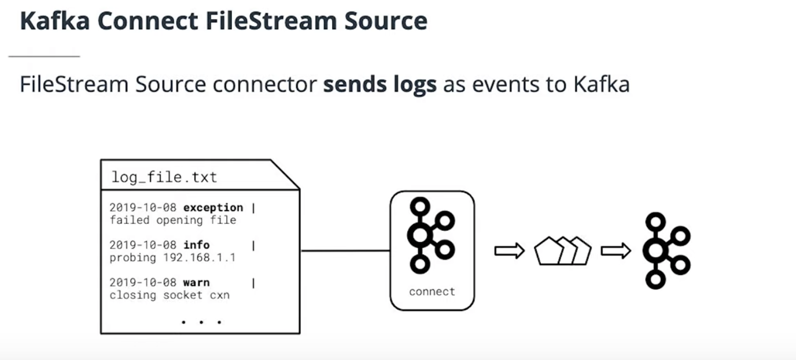

# Lesson 4: Kafka Connect and REST Proxy

Kafka Connect can be used to quickly integrate common data sources into Kafka and move data from Kafka to other data
stores. In this section we’ll learn how to use REST to consume and produce Kafka data with only an HTTP client

## Lesson Glossary of Key Terms

* Kafka Connect - A web server and framework for integrating Kafka with external data sources such as SQL databases, log
  files, and HTTP endpoints.
* JAR - **J**ava **AR**chive. Used to distribute Java code reusably in a library format under a single file.
* Connector - A JAR built on the Kafka Connect framework which integrates to an external system to either source or sink
  data from Kafka
* Source - A Kafka client putting data into Kafka from an external location, such as a data store
* Sink - A Kafka client removing data from Kafka into an external location, such as a data store
* JDBC - Java Database Connectivity. A Java programming abstraction over SQL database interactions.
* Task - Responsible for actually interacting with and moving data within a Kafka connector. One or more tasks make up a
  connector.
* Kafka REST Proxy - A web server providing APIs for producing and consuming from Kafka, as well as fetching cluster
  metadata.

## Kafka Connect

Kafka Connect is a web server and framework for integrating Kafka with external data sources like databases, log files,
and HTTP endpoints. Connect’s SQL functionality can save significant effort. Similar to Kafka, Connect:

* Was build at Confluent, now with Apache Foundation
* Is written in Java and Scala on the JVM
* Promotes reusability and simple code
* May replace the need for a Kafka client
* Can run in standalone or cluster mode, similar to Kafka and Schema Registry

## Kafka Connect Architecture

Kafka Connect is simply a web server. It needs plugins to communicate with different services. These plugins implement
the functionality of Kafka Connect. Each of these plugins will be loaded as a plugin JAR:

Since Connect is build on the JVM, it can run on nearly everything. Because of that, plugins must be implemented against
the Connect Framework API in a JVM language.

Connect uses Kafka to store its configuration and track its internal state, as shown on the right-hand side of the above
graphic.

### Connect framework components

* [Connectors](https://docs.confluent.io/platform/current/connect/concepts.html#connectors) -> abstractions for managing
  tasks
* [Tasks](https://docs.confluent.io/platform/current/connect/concepts.html#tasks) -> contain production/consumption code
* [Converters](https://docs.confluent.io/platform/current/connect/concepts.html#converters) -> map data formats to/from
  Connect
    * Kafka and target systems often have different formats

## Kafka Connect Summary

As a recap, Kafka Connect:

* can be used to handle common/repeated use cases
* is a web server built for the JVM
* has an extensible plugin architecture and rich ecosystem of existing connectors
* may enable the application to operate without a Kafka client library

### Further Reading on Kafka Connect

[Overview of Kafka Connect](https://docs.confluent.io/current/connect/concepts.html)

## Kafka Connect Connectors

Popular Kafka Connect plugins:

* [Confluent Kafka Connect Plugin Search](https://www.confluent.io/hub/?utm_medium=sem&utm_source=google&utm_campaign=ch.sem_br.brand_tp.prs_tgt.confluent-brand_mt.mbm_rgn.namer_lng.eng_dv.all&utm_term=%2Bconfluent%20%2Bconnect&creative=357969856550&device=c&placement=&gclid=Cj0KCQjwp5_qBRDBARIsANxdcikzhat8UGdi8TVVfxhSATPhQqLibR81tnJC0lVGsPaRubygAORySDEaAhrbEALw_wcB)
* [Amazon S3 Connector](https://www.confluent.io/hub/confluentinc/kafka-connect-s3)
* [SQL JDBC Connector](https://www.confluent.io/hub/confluentinc/kafka-connect-jdbc)
* [HDFS Connector](https://www.confluent.io/hub/confluentinc/kafka-connect-hdfs)
* [HTTP Connector](https://www.confluent.io/hub/confluentinc/kafka-connect-http)

## The Kafka Connect API

Connect is managed exclusively through an HTTP REST API. It supports CRUD operations on Connectors, which can be stopped
or started via API. Plugins can be added or removed while the server is running. The API aids in monitoring connectors,
but does not surface logs or metrics.

[Official REST API Documentation](https://docs.confluent.io/current/connect/references/restapi.html)

## Using the Kafka Connect API

In this exercise we’re going to make use of the Kafka Connect API.

[REST API documentation](https://docs.confluent.io/current/connect/references/restapi.html).

### Viewing Connectors

First, we can view connector-plugins:

`curl http://localhost:8083/connector-plugins | python -m json.tool`

Quick note, the `| python -m json.tool` above simply takes the output of the `curl` command and prints the JSON nicely.
You can omit this if you’d like!

### Create a Connector

Let’s create a connector. We’ll dive into more details on how this works later.

```
curl -X POST -H 'Content-Type: application/json' -d '{
    "name": "first-connector",
    "config": {
        "connector.class": "FileStreamSource",
        "tasks.max": 1,
        "file": "/var/log/journal/confluent-kafka-connect.service.log",
        "topic": "kafka-connect-logs"
    }
  }' \
  http://localhost:8083/connectors
```

### List connectors

We can list all configured connectors with:

`curl http://localhost:8083/connectors | python -m json.tool`

You can see our connector in the list.

### Detailing connectors

Let’s list details on our connector:

`curl http://localhost:8083/connectors/first-connector | python -m json.tool`

### Pausing connectors

Sometimes its desirable to pause or restart connectors:

To pause:

`curl -X PUT http://localhost:8083/connectors/first-connector/pause`

To restart:

`curl -X POST http://localhost:8083/connectors/first-connector/restart`

### Deleting connectors

Finally, to delete your connector:

`curl -X DELETE http://localhost:8083/connectors/first-connector`

### Kafka Connect Connectors - Optional Further Research

* [Confluent Connector Hub](https://www.confluent.io/hub/?_ga=2.42557541.1345547963.1563205519-78292278.1561645529)
* [List of core Connectors included with most distributions](https://docs.confluent.io/current/connect/managing/connectors.html)
* [Connect REST API Documentation](https://docs.confluent.io/current/connect/references/restapi.html)

## Key Connectors

This section will cover the more common Connectors, such as the JDBC sink and source connector and the FileStream
connector.

### FileStream Source

This source sends logs as events to Kafka. This doesn’t require configuring additional application-side logging, but
rather a FileStream source connector to monitor changes to some file on disk. The changes get captured by Kafka and
emitted as events to a topic:



With this approach, the application can remain unaware of Kafka’s involvement and simply continues writing its logs to
disk.

## Kafka Connect FileStream Source

Example exercise [here](./filestream_source.py)

## JDBC Sinks and Sources

The Java Database Connector (JDBC) API abstracts SQL interfaces for Java applications. Kafka uses JDBC to interact with
databases like MySql, Postgres, etc.

JDBC **Sinks** are common for moving data from Kafka *to* databases. Once data is in Kafka, it can be used in stream
processing for enrichment or other uses.

JDBC **Sources** are common for moving data out of Kafka into traditional data stores. Sources are often used to make
stream processing insights available for ad-hoc or batch querying.

## Kafka Connect JDBC Source

Example exercise [here](./jdbc_source.py)
Mock data [here](./mock_clicks.py)

### Further Reading — Connector Source Documentation

* [Kafka FileStream Connector Documentation](https://docs.confluent.io/current/connect/filestream_connector.html)
* [Kafka JDBC Source Connector Documentation](https://docs.confluent.io/current/connect/kafka-connect-jdbc/index.html)

## Kafka REST Proxy

Clients that are unable to integrate either Kafka clients or Kafka Connect can still integrate with Kafka through the
REST proxy, provided they have an HTTP client. This section will cover how the REST proxy works.

## REST Proxy Architecture

Nothing new here:

* Written in Java/Scala, runs on JVM
* May run standalone or clustered
* Transforms structured JSON data into Kafka’s binary format and vice-versa
* Cannot create topics, only get topic metadata
    * Is useful for reading basic administrative metadata
* Can be made Schema Registry aware
* Most useful when Kafka client or Connect are not options
    * Proxy isn’t recommended unless necessary, since a client or Connect will provide time-saving abstractions and
      performance benefits

## Practice: REST Proxy Metadata API

[Exercise here](./proxy_metadata_api.py)

## REST Proxy Summary

## Using REST Proxy

## Review of REST Proxy Usage

## Producing JSON Data via REST Proxy

## Producing Avro Data via REST Proxy

## Consuming Data with REST Proxy

## Practice: Consuming Avro Data via REST Proxy

## Summary: Using REST Proxy

## Lesson Summary
